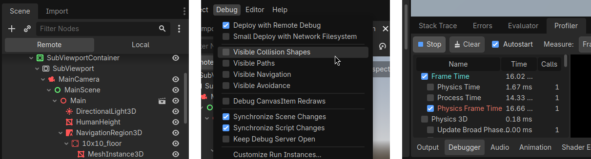
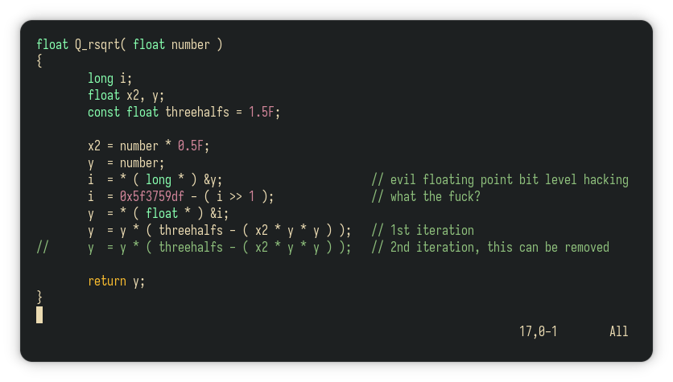
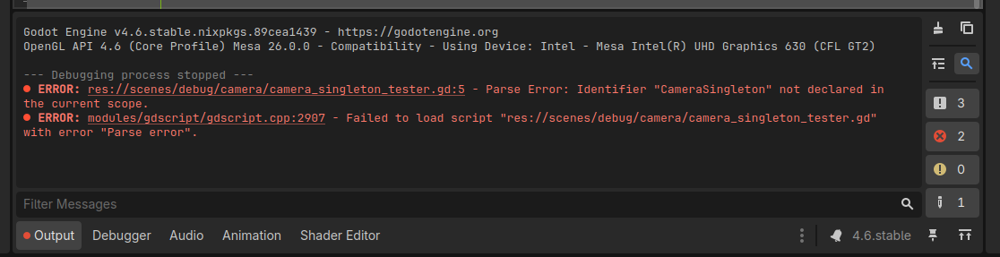

# Contribution Guidelines
**tl;dr**: The main requirements to getting your code pulled are:
- making it easy to debug
- making it easy for others to read
- making it easy for others to use
- not forcing anyone to change their workflows unnecessarily
- not breaking the repository state

Fixing minor bugs is secondary - this can be done in further pull requests.

## Making it easy to debug

> [!IMPORTANT]
> 
> 
> Godot has an extensive suite of debugging tools. If any of them can't be used as a 
> result of your pull request (e.g. - can't use the override camera or can't modify
> the remote scene tree) this is considered a major bug

Ask yourself:
- Can we modify your node's state in the remote viewer?
- Can we quickly modify its main parameters to test them?
- Is the main code path easy to follow?
- Is it easy to reason what is happening inside your code for others?

If not, then it's probably not easy to debug.

## Making it easy for others to read

> [!NOTE]
> The fast inverse square root algorithm - an infamous example of an unreadable function
> 

The code that's easiest for other people to follow is also hardest to write. And because it's obvious to read it's also very hard to estimate how much work was put into it!

Ask yourself - will you be able to understand your code after two months? Will other people understand exactly what's happening at a glance? This is a major topic, and it will be discussed in much more detail in the following sections

## Making it easy for others to use
This point is hard to evaluate without prior experience, especially since everything we do is subjective. This is best caught during code reviews. However, you can ask yourself:
- Did I export enough variables for my users to modify?
- Is it easy to integrate my node with the scene tree?
- Are the results visible immediately?
- Do the end users know they're using your node wrong?
- If this were shipped with Godot by default would it fit or would it stick out?

Trace the steps you took to integrate your solution with the main scene. If you notice that you can simplify some of them - do that.

## Not forcing anyone to change their workflows unnecessarily
Does your solution force others to:
- Write future code in a specific way?
- Structure their nodes in a specific way?

Then it's probably not a good fit for this project.

## Not breaking the repository state
> [!CAUTION]
> Don't let any errors into the main repo!
>
> 

This one is very simple:
- Does the main project crash?
- Do any of the scenes crash?
- Are any additional warnings being emitted?
- Are there any unnecessary debug print statements?

If yes - fix this.
